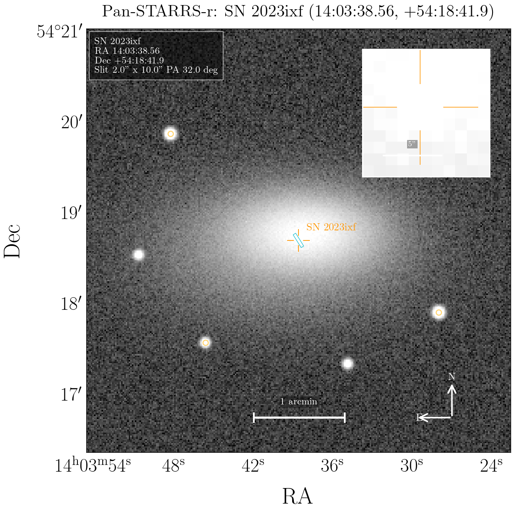

# TransientFinderchart

[](pyproject.toml)
[](finding_chart_plotter/qt_compat.py)
[](https://www.astropy.org/)
[](LICENSE)
[](docs/IMPLEMENTATION_LOG.md)

TransientFinderchart is a desktop GUI for making observation-ready finding
charts for supernovae and other transients. It resolves targets from TNS or
manual coordinates, downloads archival image cutouts, injects a visual transient
PSF, overlays slit geometry, and exports annotated charts as PNG, JPG, or PDF.



## Features

| Area | Options |
| --- | --- |
| Target input | TNS/IAU name, ZTF/internal name through TNS, or custom RA/Dec |
| Archives | Pan-STARRS, Legacy Survey, DSS2, 2MASS |
| Image modes | Single band by default, color composite where supported |
| Bands | Survey-specific band dropdowns |
| Field size | Default 3 arcmin x 3 arcmin, user adjustable |
| Contrast | Automatic percentile/asinh stretch, or manual `vmin`/`vmax` |
| Transient injection | Empirical field-star PSF at the transient WCS position, with Moffat fallback |
| Flux scaling | Gaia field-star scaling when catalog sources are loaded, otherwise image-statistics fallback |
| Overlays | SN marker, label, optional slit, north/east compass, 1 arcmin ruler, 30 arcsec transient inset |
| Slit | Off by default; 2 arcsec x 20 arcsec when enabled, adjustable width, length, and fixed PA east of north |
| Parallactic angle | Computed from target, observatory, and date/time |
| Catalog | Gaia DR3 source query and overlay |
| Export | PNG, JPG, PDF |

## Image Archives

| Survey | Bands / Modes | Notes |
| --- | --- | --- |
| Pan-STARRS | `g r i z y`, color composite | Northern sky coverage, fetched from STScI PS1 services |
| Legacy Survey | `g r i z`, color composite | FITS cutout first; JPEG fallback with approximate TAN WCS if the FITS service returns HTTP 500 |
| DSS2 | `red blue ir` | Fetched through SkyView |
| 2MASS | `J H K` | Fetched through SkyView |

Additional southern/NIR surveys that would be useful future additions include
VISTA/VHS, VIKING, SkyMapper, DECaLS/NOIRLab services beyond the current Legacy
Survey endpoint, and DES cutouts where a stable public FITS service is available.

## Install

```bash
python3 -m pip install -r requirements.txt
```

For development:

```bash
python3 -m venv .venv
.venv/bin/python -m pip install --upgrade pip setuptools wheel
.venv/bin/python -m pip install -e .
```

TNS credentials should be kept out of git:

```bash
export TNS_API_KEY="..."
export TNS_BOT_ID="..."
export TNS_BOT_NAME="..."
```

## Run

```bash
python3 run_finding_chart.py
```

or:

```bash
python3 -m finding_chart_plotter
```

If you are inside a conda environment that already has PyQt6 installed and
PySide6 fails with a Qt symbol error, run with the PyQt6 compatibility path:

```bash
FINDING_CHART_QT_API=pyqt6 python run_finding_chart.py
```

The project-local virtual environment can be run directly with:

```bash
.venv/bin/python run_finding_chart.py
```

## Basic Workflow

1. Search a target by TNS/IAU/ZTF name, or enter custom RA/Dec.
2. Select an archive, image mode, band, cutout size, and pixel scale.
3. Load the image cutout.
4. Optionally query Gaia DR3 for field-star overlays and PSF flux scaling.
5. Adjust slit PA, slit dimensions, observatory, date/time, and contrast.
6. Export the finding chart as PNG, JPG, or PDF.

## First Test Targets

- `2023ixf`
- `2024ggi`
- `2025wny`

## Observatory Presets

- La Palma
- Mauna Kea, Hawaii
- Paranal, Chile
- Palomar Observatory
- La Silla, Chile
- HCT / IAO, India
- Kanata, Hiroshima

## Notes

- The date/time control defaults to the current date and time at launch.
- The PA convention is degrees east of north.
- The injected PSF is intended for visual finding-chart use, not calibrated photometry.
- Manual contrast controls override the automatic percentile/asinh stretch.
- Gaia DR3 overlays are implemented. Pan-STARRS/Legacy Tractor catalog overlays are future work.
- Legacy Survey FITS server errors fall back to a JPEG cutout with approximate centered TAN WCS when possible.
- Full worker tracebacks are printed to stderr; the GUI shows compact user-facing error messages.

## Acknowledgments

The in-plot metadata box and transient inset were inspired by Sean Brennan's
[`Astro-Sean/finder_chart`](https://github.com/Astro-Sean/finder_chart), a
simple Astropy-based finder-chart script for transient identification.

## Development Log

See [docs/IMPLEMENTATION_LOG.md](docs/IMPLEMENTATION_LOG.md).
