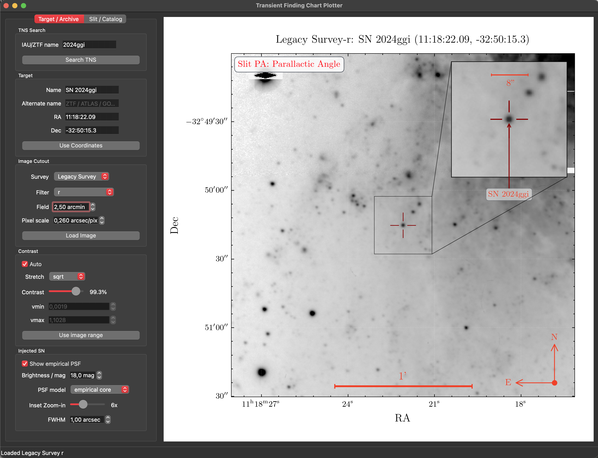

# TransientFinderchart

[](pyproject.toml)
[](findingchart_guiplotter/qt_compat.py)
[](findingchart_macapp)
[](tests)
[](LICENSE)

Finding-chart tool for supernovae and other transients, available as a Qt desktop GUI, local development web interface, and experimental native macOS app.

Resolve TNS or manual targets, fetch archival cutouts, add a visual fake source and observing overlays, then export PNG, JPEG, or PDF charts.

The chart design is inspired by Sean Brennan's [`Astro-Sean/finder_chart`](https://github.com/Astro-Sean/finder_chart).



## Features

- **Images:** Pan-STARRS, Legacy Survey, DSS2, and 2MASS cutouts with survey filters and supported color composites.
- **Charts:** WCS-aware inset, slit PA, parallactic angle, compass, scale bar, crosshair, contrast controls, and color maps.
- **Fake source:** automatic FWHM estimation plus Moffat and empirical PSF models with adjustable brightness.
- **Catalogs:** Gaia DR3 and Pan-STARRS DR2 overlays with magnitude/distance cuts and selectable markers.
- **Blind offsets:** delta RA/Dec, PA east of north, magnitude, and available Gaia parallax and proper motion.
- **Export:** PNG, JPEG, and PDF; the macOS app also provides high-DPI presets.

## Quick start

Python 3.9 or newer is required. For editable development:

```bash
python3 -m venv .venv
.venv/bin/python -m pip install --upgrade pip setuptools wheel
.venv/bin/python -m pip install -e .
```

Alternatively, install the runtime requirements with `python3 -m pip install -r requirements.txt`.

### Desktop GUI

```bash
python3 run_finding_chart.py
# or, after an editable install:
findingchart-guiplotter
```

If a conda environment already uses PyQt6:

```bash
FINDING_CHART_QT_API=pyqt6 python3 run_finding_chart.py
```

### Development web interface

```bash
python3 -m findingchart_guiplotter.web --host 127.0.0.1 --port 8765
```

Open `http://127.0.0.1:8765`. The server has no production hardening, so keep it bound to `127.0.0.1` and do not expose it to an untrusted network.

### Native macOS interface

Requires macOS 14+, Swift 5.9+, and a Python environment containing the project dependencies.

```bash
cd findingchart_macapp
export FINDING_CHART_PYTHON="/absolute/path/to/.venv/bin/python"
export FINDING_CHART_REPO="/absolute/path/to/transient-finderchart"
swift run findingchart_macapp
```

See the [native interface README](findingchart_macapp/README.md) for bridge and storage details.

## Workflow

1. Resolve a TNS/IAU/ZTF name or enter custom coordinates.
2. Choose the survey, filter, field size, and pixel scale; then load the cutout.
3. Optionally query Gaia DR3 or Pan-STARRS DR2 and select a star for blind-offset details.
4. Adjust the slit, parallactic angle, overlays, fake source, inset, observatory/time, and contrast.
5. Export the chart.

## Configuration and notes

For authenticated TNS queries, set these variables. Credentials are never stored in the repository.

```bash
export TNS_API_KEY="..."
export TNS_BOT_ID="..."
export TNS_BOT_NAME="..."
export TNS_TYPE="bot"  # optional; this is the default
```

Without credentials, the app uses public TNS search where possible.

- Online lookups depend on third-party services; Pan-STARRS 3π coverage is principally north of −30°.
- Failed Legacy Survey FITS requests fall back to JPEG with approximate centered TAN WCS.
- Gaia proper motion is displayed but is not propagated to the observing epoch.
- Slit and blind-offset PA are measured east of north.
- The fake source is visual only, not a calibrated photometric simulation.
- Web exports accumulate in `web_exports/`; native outputs and caches use `findingchart_macapp/rendered_charts/`.
- Run `python3 -m pytest -q` for the 62-test offline suite.
- Run `python3 tests/psf_diagnostics.py` to regenerate plots in `tests/figures/`.
- See [docs/IMPLEMENTATION_LOG.md](docs/IMPLEMENTATION_LOG.md) for the implementation history, audit, roadmap, and detailed limitations.
