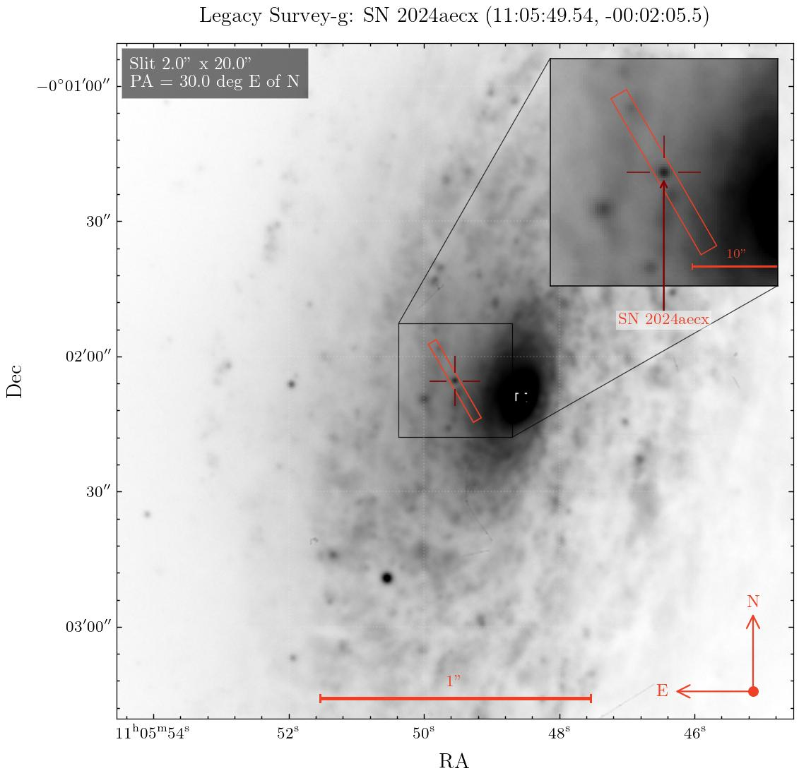

# TransientFinderchart

[](pyproject.toml)
[](findingchart_guiplotter/qt_compat.py)
[](findingchart_macapp)
[](tests)
[](LICENSE)

Desktop and development-web finding chart tool for transient observations. It resolves TNS/manual targets, fetches archival cutouts, injects a visual SN PSF, overlays slit/catalog geometry, and exports PNG/JPG/PDF charts.



## Features

- Archives: Pan-STARRS, Legacy Survey, DSS2, 2MASS.
- Bands/modes: survey-specific single-band and color-composite options.
- Chart overlays: SN marker, FOV-scaled 3x inset, slit, compass, 1 arcmin ruler.
- Injected SN: empirical field-star PSF with Moffat fallback.
- Catalogs: Gaia DR3 with VizieR fallback and Pan-STARRS DR2 overlays with brightness cut and inset markers.
- Blind offsets: selected catalog stars report delta RA, delta Dec, PA east of north, magnitude, and Gaia parallax/proper motion when available.
- Export: PNG, JPG, PDF.

## Install

```bash
python3 -m pip install -r requirements.txt
```

For editable development:

```bash
python3 -m venv .venv
.venv/bin/python -m pip install --upgrade pip setuptools wheel
.venv/bin/python -m pip install -e .
```

## Run

### 1. Desktop Python GUI

Use this for the main PySide6/PyQt6 finding-chart application:

```bash
python3 run_finding_chart.py
```

If PySide6 fails in a conda environment with PyQt6 already installed:

```bash
FINDING_CHART_QT_API=pyqt6 python run_finding_chart.py
```

### 2. Development Web Interface

Use this for the lightweight browser interface backed by the same Python renderer:

```bash
python3 -m findingchart_guiplotter.web --host 127.0.0.1 --port 8765
```

Open `http://127.0.0.1:8765`.

### 3. Native macOS SwiftUI Interface

Use this for the experimental native macOS shell around the Python pipeline:

```bash
cd findingchart_macapp
swift run findingchart_macapp
```

Set `FINDING_CHART_PYTHON` to a virtualenv/conda Python with the package dependencies when needed.

## Workflow

1. Search TNS/IAU/ZTF name or enter custom RA/Dec.
2. Select archive, mode, band, field size, and pixel scale.
3. Load the image.
4. Optionally query Gaia DR3 or Pan-STARRS DR2 with a brightness cut.
5. Click a catalog marker in the main chart or inset for blind-offset details.
6. Adjust slit, overlays, injected SN, observatory/time, and contrast.
7. Export the chart.

## TNS Credentials

TNS credentials are not saved in this repository. `findingchart_guiplotter/tns.py` reads them from environment variables when present:

```bash
export TNS_API_KEY="..."
export TNS_BOT_ID="..."
export TNS_BOT_NAME="..."
```

Without these variables, the app falls back to public TNS search where possible.

## Notes

- PA convention is degrees east of north.
- Injected PSF is for visual finding-chart use, not calibrated photometry.
- The web interface reuses the Python renderer and writes generated PNGs to `web_exports/`.
- Legacy Survey FITS failures fall back to a JPEG cutout with approximate centered TAN WCS when possible.
- See [docs/IMPLEMENTATION_LOG.md](docs/IMPLEMENTATION_LOG.md) for development history.
